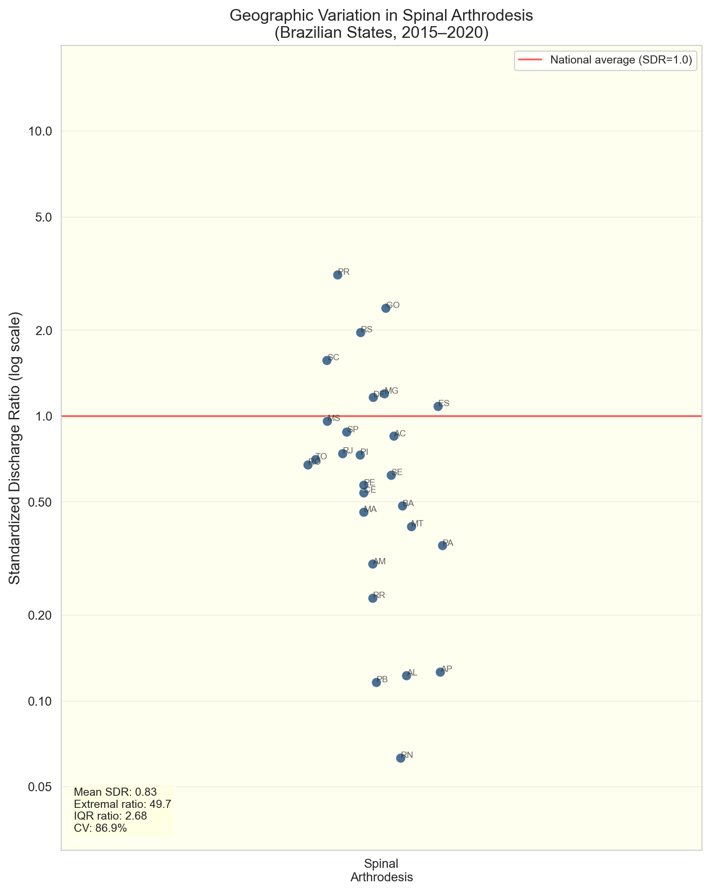
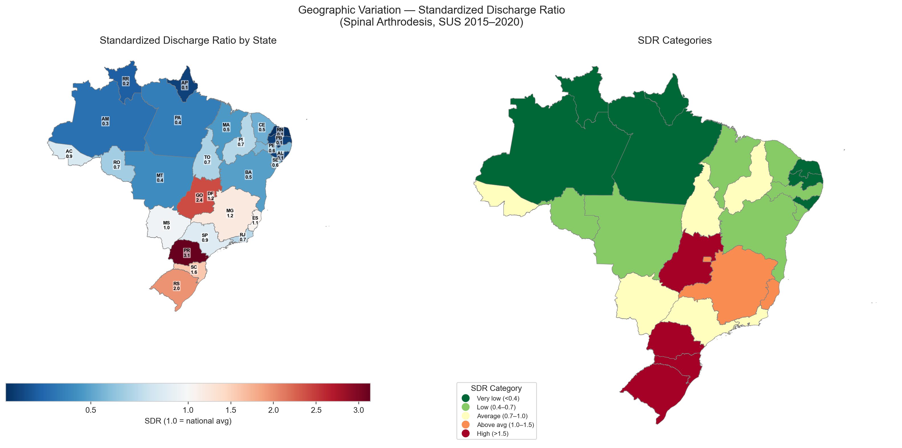
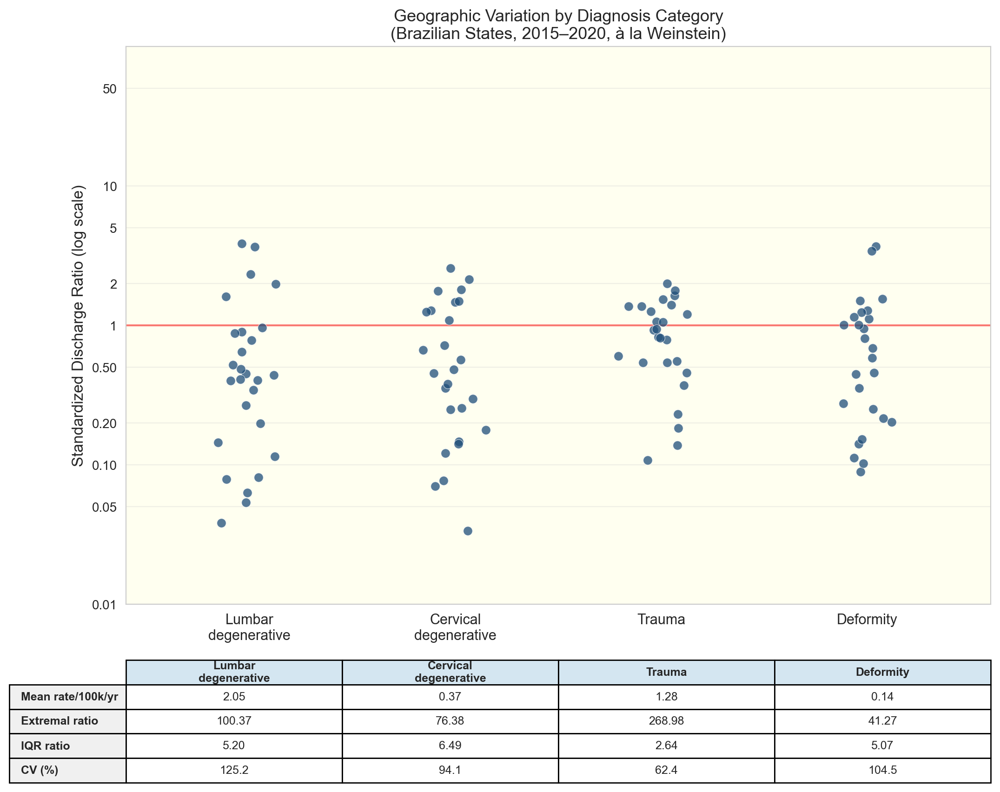
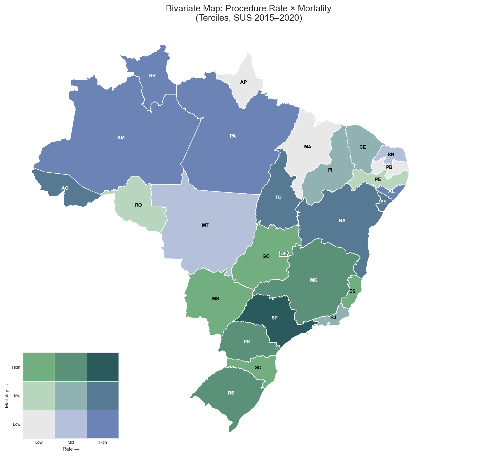
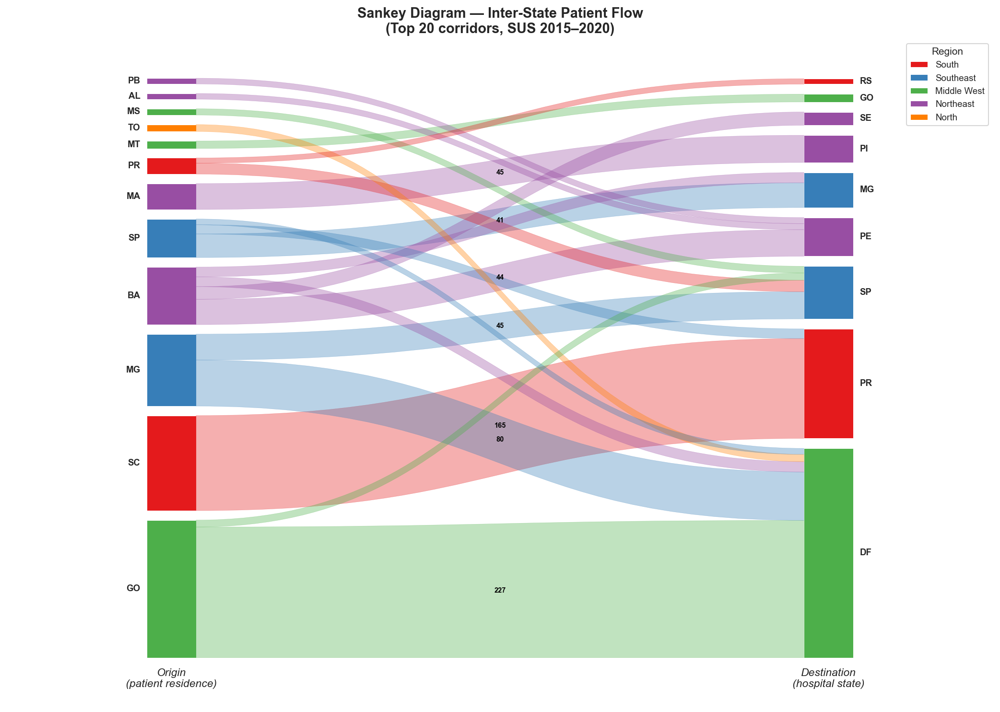
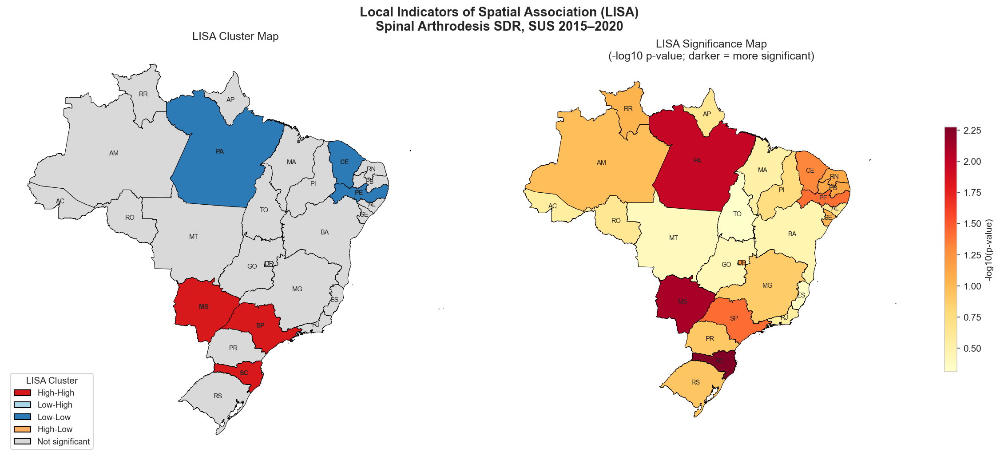

# Geographic Variation in Spinal Arthrodesis in Brazil (SUS, 2015--2020)

> **Weinstein-style analysis of 58,818 spinal fusion procedures across 27 Brazilian states, revealing nearly double the geographic variation found in the US Medicare system.**

[](https://www.python.org/downloads/)
[](LICENSE)

---

## Key Findings

| Metric | Brazil SUS | US (Weinstein) |
|--------|:----------:|:--------------:|
| CV (%) | **86.9** | 49.5 |
| Extremal ratio | **49.7** | 21.0 |
| IQR ratio | **2.68** | 2.01 |

- **58,818 procedures** across 27 states; national rate = 4.66 per 100,000/year
- Lumbar degenerative (44% of volume) shows the highest variation (CV = 125.2%); trauma (27%) the lowest (CV = 62.4%)
- Specialist density is the strongest predictor of procedure rates (Spearman rho = 0.74, p < 0.001)
- Significant spatial clustering (Moran's I = 0.42, p = 0.004): high-high in the South, low-low in the North/Northeast
- Only 2.1% of patients cross state borders; Brasilia (DF) imports 28.8% of its caseload

## Selected Figures

<table>
<tr>
<td width="50%"><br><em>SDR beeswarm -- all 27 states</em></td>
<td width="50%"><br><em>SDR diverging choropleth</em></td>
</tr>
<tr>
<td width="50%"><br><em>Weinstein-style variation by diagnosis</em></td>
<td width="50%"><br><em>Bivariate rate x mortality</em></td>
</tr>
<tr>
<td width="50%"><br><em>Inter-state patient flow (top 20 corridors)</em></td>
<td width="50%"><br><em>LISA spatial clusters</em></td>
</tr>
</table>

## Reproduce

```bash
# 1. Clone and enter
git clone https://github.com/matheus-rech/SpineSurgeryVariations_BR.git
cd SpineSurgeryVariations_BR

# 2. Setup environment (Python 3.13+)
python3.13 -m venv .venv && source .venv/bin/activate
pip install -r requirements.txt

# 3. Place the dataset
# data/artrodese_v7.xlsx (26 MB, 58,818 rows) -- obtain from the principal investigator

# 4. Execute the full analysis (~3-5 min)
jupyter nbconvert --to notebook --execute \
  --ExecutePreprocessor.timeout=600 \
  comprehensive_analysis.ipynb \
  --output comprehensive_analysis_executed.ipynb

# 5. Verify outputs
shasum -c output/MANIFEST.sha1
```

> **Note:** First run downloads ~50 MB of IBGE shapefiles via `geobr` (cached for subsequent runs).

## Repository Structure

```
comprehensive_analysis.ipynb       Main analysis notebook (17 sections, 68 cells)
generate_manuscript.js             Manuscript .docx generation script
run_section17.py                   Standalone Sankey/Chord diagram script
requirements.txt                   Pinned Python 3.13 dependencies
REPRODUCE.md                       Detailed reproducibility guide
CLAUDE.md                          Project documentation for AI-assisted development
data/
  artrodese_v7.xlsx                Primary dataset (not in git)
output/
  manuscript_arthrodesis_brazil.docx   Spine journal-style manuscript draft
  findings_*.md                    Written findings (3 documents)
  table*.csv                       Data tables (14 CSVs)
  *.png                            Figures (30 PNGs)
  MANIFEST.sha1                    Checksum verification
```

## Analysis Pipeline

The notebook is organized into 17 sequential sections:

| # | Section | Key Outputs |
|:-:|---------|-------------|
| 1 | Setup & Data Loading | -- |
| 2 | Descriptive Statistics | Age distribution, top diagnoses |
| 3 | Inflation Adjustment | IPCA-adjusted costs |
| 4 | Population-Adjusted Rates | State/region rates per 100k |
| 5 | Age-Sex Standardization | WHO standard population weights |
| 6 | Temporal Trends | Yearly/monthly series, COVID marker |
| 7 | Choropleth Maps | Rate, quartile, mortality maps |
| 8 | Specialist Workforce | Density-rate correlation |
| 9 | Forest Plot | State rates with 95% CI |
| 10 | Summary Tables | CSV exports |
| 11 | Weinstein Variation | CV, extremal ratio, IQR ratio, SDR beeswarm |
| 12 | Diagnosis-Specific | Lumbar/cervical/trauma/deformity variation |
| 13 | Municipality Analysis | Small area variation (N=951) |
| 14 | Enhanced Choropleths | SDR, diagnosis-specific, bivariate rate x mortality |
| 15 | Patient Flow Network | Flow arrows, micropoint density |
| 16 | Statistical Testing | Kruskal-Wallis, Moran's I, LISA, Mann-Kendall, Chi-square |
| 17 | Sankey & Chord | Inter-state patient flow diagrams |

## Data Sources

| Source | Description |
|--------|-------------|
| [DATASUS SIH/SUS](http://www2.datasus.gov.br/) | Hospital Information System -- procedure records |
| [IBGE](https://www.ibge.gov.br/) | State population estimates |
| WHO | World standard population (Segi/Doll weights) |
| IPCA | Consumer price index for inflation adjustment |
| CFM/CNES | Specialist counts by state |

## Statistical Methods

- **Weinstein metrics:** CV, extremal ratio, IQR ratio, SDR (state and municipality levels)
- **Spatial statistics:** Global Moran's I (Queen contiguity, 9,999 permutations), LISA clusters
- **Comparisons:** Kruskal-Wallis with Dunn's post-hoc (5 macro-regions)
- **Trends:** Mann-Kendall with Sen's slope (2015--2020)
- **Correlations:** Spearman rank (rate vs. specialist density, age, cost, mortality)
- **Categorical:** Chi-square with Cramer's V (diagnosis x region)

## Citation

> [Authors]. Geographic Variation in Spinal Arthrodesis Rates in Brazil's Universal Healthcare System: A Weinstein-Style Analysis of 58,818 Procedures (2015--2020). *[Journal]*. [Year].

## Reference

Weinstein JN, Lurie JD, Olson PR, et al. United States' trends and regional variations in lumbar spine surgery: 1992--2003. *Spine (Phila Pa 1976)*. 2006;31(23):2707--2714.

## License

This project is licensed under the MIT License. The dataset (`data/artrodese_v7.xlsx`) is not included and must be obtained from the principal investigator.
